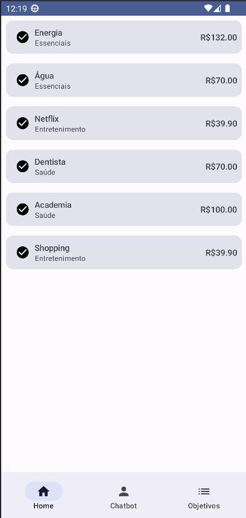
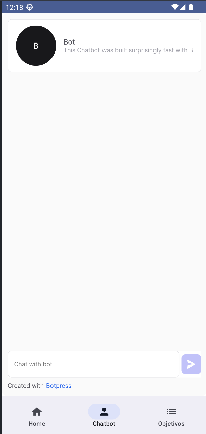

# PoC Finanças App

A PoC Finanças App teve como objetivo principal a integração do aplicativo com o chatbot, utilizando
as tecnologias Kotlin e Jetpack Compose.

## Funcionalidades implementadas

- Integração com o chatbot
- Registro de despesas
- Injeção de Dependência
- Android Jetpack Components

## Tecnologias utilizadas

- **Linguagem de Programação**: Kotlin
- **UI ToolKit**: Jetpack Compose
- **Injeção de Dependência**: Dagger/Hilt
- **Botpress Web Integration**: WebView

## Screenshots

Obs: As Telas desenvolvidas têm apenas o objetivo de demonstrar as funcionalidades, o
desenvolvimento fiel à prototipação está fora do escopo da PoC.

